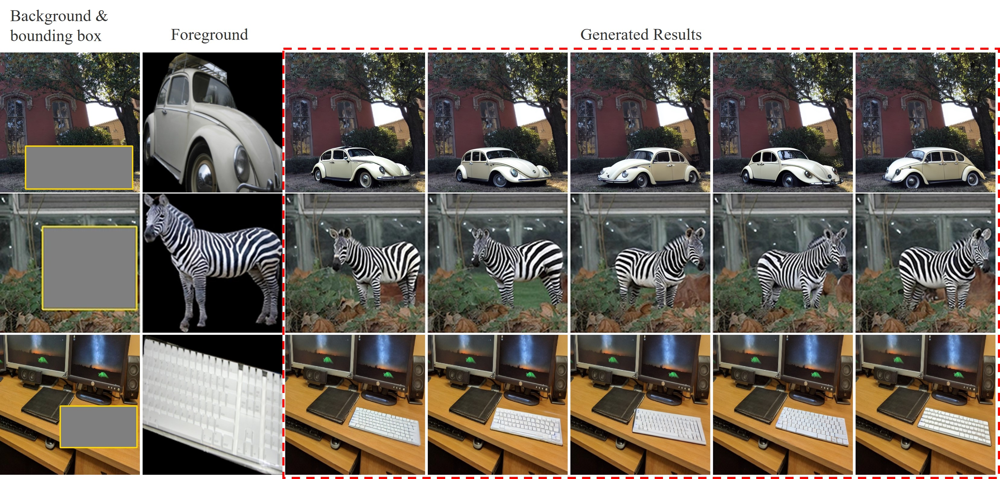

# Awesome Generative Image Composition [](https://github.com/sindresorhus/awesome)

A curated list of resources including papers, datasets, and relevant links pertaining to generative image composition (object insertion). **Generative image composition aims to generate plausible composite images based on a background image (optional bounding box) and a (*resp.*, a few) foreground image (*resp.*, images) of a specific object.** For more complete resources on general image composition ([object insertion](https://github.com/bcmi/Awesome-Object-Insertion)), please refer to [Awesome-Image-Composition](https://github.com/bcmi/Awesome-Object-Insertion).

<p align='center'>  
  
</p>

## Contributing

Contributions are welcome.  If you wish to contribute, feel free to send a pull request. If you have suggestions for new sections to be included, please raise an issue and discuss before sending a pull request.

## Table of Contents
+ [Survey](#Survey)
+ [Online Demo](#Online-demo)
+ [Evaluation Metrics](#Evaluation-metrics)
+ [Datasets](#Datasets)
+ [Leaderboard](#Leaderboard)
+ [Papers](#Papers)
+ [Related Topics](#Related-topics)
+ [Other Resources](#Other-resources)

## Survey

A brief review on generative image composition is included in the following survey on image composition:

Li Niu, Wenyan Cong, Liu Liu, Yan Hong, Bo Zhang, Jing Liang, Liqing Zhang: "*Making Images Real Again: A Comprehensive Survey on Deep Image Composition.*" arXiv preprint arXiv:2106.14490 (2021). [[arXiv]](https://arxiv.org/pdf/2106.14490.pdf)  [[slides]](https://www.ustcnewly.com/download/Image_composition_tutorial.pdf)


## Online Demo

Try this [online demo](https://bcmi.sjtu.edu.cn/home/niuli/demo_image_composition/) for generative image composition and have fun! 


## Evaluation Metrics

+ [Composite-Image-Evaluation](https://github.com/bcmi/Composite-Image-Evaluation)


## Datasets

+ [COCOEE](https://github.com/Fantasy-Studio/Paint-by-Example?tab=readme-ov-file#test-benchmark) (within-domain, single-ref): 500 background images from MSCOCO validation set.  Each background image has a bounding box and a foreground image from MSCOCO training set.
+ [TF-ICON test benchmark](https://github.com/Shilin-LU/TF-ICON?tab=readme-ov-file#tf-icon-test-benchmark) (cross-domain, single-ref): 332 samples. Each sample consists of a background image, a foreground image, a
user mask, and a text prompt.
+ [DreamEditBench](https://huggingface.co/datasets/tianleliphoebe/DreamEditBench) (within-domain, multi-ref): 220 background images and 30 unique foreground objects from 15 categories. 
+ [MureCom](https://github.com/bcmi/DreamCom-Image-Composition?tab=readme-ov-file#our-murecom-dataset) (within-domain, multi-ref): 640 background images and 96 unique foreground objects from 32 categories.
+ [SAM-FB](https://github.com/KaKituken/affordance-aware-any) (within-domain, single-ref): built upon SA-1B (SAM dataset). 3,160,403 images with 3,439 foreground categories.
+ [Subjects 200K](https://github.com/Yuanshi9815/Subjects200K) (within-domain, double-ref): 200,000 paired images. Each pair has the same subject yet various scene contexts.
+ [ORIDa](https://hello-jinwoo.github.io/orida/) (within-domain, multi-ref): 200 unique foreground objects. Each object is placed in an average of 50 diverse scenes. In each scene, one object is placed at 1~4 different positions.

## Leaderboard

The training set is open. The test set is [COCOEE](https://github.com/Fantasy-Studio/Paint-by-Example?tab=readme-ov-file#test-benchmark) benchmark. Partial results are copied from [ControlCom](https://github.com/bcmi/ControlCom-Image-Composition). Honestly speaking, the following evaluation metrics are not very reliable. For more comprehensive and interpretable evaluation, you can refer to this [summary](https://github.com/bcmi/Composite-Image-Evaluation) of evaluation metrics.

<table class="tg">
  <tr>
    <th class="tg-0pky" rowspan="2" align="center">Method</th>
    <th class="tg-0pky" colspan="3" align="center">Foreground</th>
    <th class="tg-0pky" colspan="2" align="center">Background</th>
    <th class="tg-0pky" colspan="2" align="center">Overall</th>
  </tr>
  <tr>
    <th class="tg-0pky" align="center">CLIP&uarr;</th>
    <th class="tg-0pky" align="center">DINO&uarr;</th>
    <th class="tg-0pky" align="center">FID&darr;</th>
    <th class="tg-0pky" align="center">LSSIM&uarr;</th>    
    <th class="tg-0pky" align="center">LPIPS&darr;</th>
    <th class="tg-0pky" align="center">FID&darr;</th>
    <th class="tg-0pky" align="center">QS&uarr;</th>
  </tr>
<tr>
  <th class="tg-0pky" align="center">Inpaint&Paste</th>
    <th class="tg-0pky" align="center">-</th>
  <th class="tg-0pky" align="center">-</th>
    <th class="tg-0pky" align="center">8.0</th>
    <th class="tg-0pky" align="center">-</th>    
    <th class="tg-0pky" align="center">-</th>
    <th class="tg-0pky" align="center">3.64</th>
    <th class="tg-0pky" align="center">72.07</th>
  </tr>
  <th class="tg-0pky" align="center"><a href="https://arxiv.org/pdf/2211.13227.pdf">PBE</a> </th>
    <th class="tg-0pky" align="center">84.84</th>
  <th class="tg-0pky" align="center">52.52</th>
    <th class="tg-0pky" align="center">6.24</th>
    <th class="tg-0pky" align="center">0.823</th>    
    <th class="tg-0pky" align="center">0.116</th>
    <th class="tg-0pky" align="center">3.18</th>
    <th class="tg-0pky" align="center">77.80</th>
  </tr>   
  <th class="tg-0pky" align="center"><a href="https://arxiv.org/pdf/2212.00932.pdf">ObjectStitch</a></th>
    <th class="tg-0pky" align="center">85.97</th>
    <th class="tg-0pky" align="center">61.12</th>
    <th class="tg-0pky" align="center">6.86</th>
    <th class="tg-0pky" align="center">0.825</th>    
    <th class="tg-0pky" align="center">0.116</th>
    <th class="tg-0pky" align="center">3.35</th>
    <th class="tg-0pky" align="center">76.86</th>
  </tr>  
  
  <th class="tg-0pky" align="center"><a href="https://arxiv.org/pdf/2307.09481.pdf">AnyDoor</a></th>
    <th class="tg-0pky" align="center">89.7</th>
    <th class="tg-0pky" align="center">70.16</th>
    <th class="tg-0pky" align="center">10.5</th>
    <th class="tg-0pky" align="center">0.870</th>    
    <th class="tg-0pky" align="center">0.109</th>
    <th class="tg-0pky" align="center">3.60</th>
    <th class="tg-0pky" align="center">76.18</th>
  </tr>
  <th class="tg-0pky" align="center"><a href="https://arxiv.org/pdf/2308.10040.pdf">ControlCom</a></th>
    <th class="tg-0pky" align="center">88.31</th>
    <th class="tg-0pky" align="center">63.67</th>
    <th class="tg-0pky" align="center">6.28</th>
    <th class="tg-0pky" align="center">0.826</th>    
    <th class="tg-0pky" align="center">0.114</th>
    <th class="tg-0pky" align="center">3.19</th>
    <th class="tg-0pky" align="center">77.84</th>
  </tr>
</table>

### Evaluating Your Results

1. **Install Dependencies**:
   - Begin by installing the dependencies listed in [requirements.txt](./requirements.txt).
   - Additionally, install [Segment Anything](https://github.com/facebookresearch/segment-anything).

2. **Clone Repository and Download Pretrained Models**:
   - Clone this repository and ensure you have a `checkpoints` folder.
   - Download the following pretrained models into the `checkpoints` folder:
     - [openai/clip-vit-base-patch32](https://huggingface.co/openai/clip-vit-base-patch32): Used for CLIP score and FID score calculations.
     - [ViT-H SAM model](https://github.com/facebookresearch/segment-anything?tab=readme-ov-file#model-checkpoints): Utilized to estimate foreground masks for reference images and generated composites.
     - [facebook/dino-vits16](https://huggingface.co/facebook/dino-vits16): Employed in DINO score computation.
     - [coco2017_gmm_k20](https://github.com/Fantasy-Studio/Paint-by-Example#qs-score): Utilized to compute the overall quality score.

   The resulting folder structure should resemble the following:
   ```shell
   checkpoints/
   ├── clip-vit-base-patch32
   ├── coco2017_gmm_k20
   ├── dino-vits16
   └── sam_vit_h_4b8939.pth
   ```

<!-- 3. **Download Cache File for FID Scores**:
   - Download the cache file from [Google Drive](https://drive.google.com/file/d/1m5EXLb2fX95uyl2dYtQUudjnFsGhN5dU/view?usp=sharing) used for computing FID scores.
   - Unzip the cache file to a `cache` folder as follows:
     ```shell
     cache/
     ├── coco2017_test.pth
     └── cocoee_gtfg.pth
     ```
   Alternatively, you can download the test set of [COCO2017](http://images.cocodataset.org/zips/test2017.zip) in advance and unzip it to a `data` folder. -->

3. **Prepare COCOEE Benchmark and Your Results**:
   - Prepare the [COCOEE benchmark](https://github.com/Fantasy-Studio/Paint-by-Example?tab=readme-ov-file#test-benchmark) alongside your generated composite results. Ensure that your composite images have filenames corresponding to the background images of the COCOEE dataset, as illustrated below:
      ```shell
      results/
      ......
      ├── 000002228519_GT.png
      ├── 000002231413_GT.png
      ├── 900100065455_GT.png
      └── 900100376112_GT.png
      ```
   - Modify the paths accordingly in the `run.sh` file. If you have downloaded the cache file mentioned earlier, please ignore `cocodir`.
   - Execute the following command:
     ```shell
     sh run.sh
     ```
   Then, wait for the results of all metrics to be computed.


## Papers

### Training-free
+ Yibin Wang, Weizhong Zhang, Jianwei Zheng, Cheng Jin: "*PrimeComposer: Faster Progressively Combined Diffusion for Image Composition with Attention Steering.*" ACM MM (2024) [[pdf]](https://dl.acm.org/doi/pdf/10.1145/3664647.3680848) [[code]](https://github.com/CodeGoat24/PrimeComposer)
+ Shilin Lu, Yanzhu Liu, Adams Wai-Kin Kong: "*TF-ICON: Diffusion-based Training-free Cross-domain Image Composition.*" ICCV (2023) [[pdf]](https://openaccess.thecvf.com/content/ICCV2023/papers/Lu_TF-ICON_Diffusion-Based_Training-Free_Cross-Domain_Image_Composition_ICCV_2023_paper.pdf) [[code]](https://github.com/Shilin-LU/TF-ICON)
+ Roy Hachnochi, Mingrui Zhao, Nadav Orzech, Rinon Gal, Ali Mahdavi-Amiri, Daniel Cohen-Or, Amit Haim Bermano: "*Cross-domain Compositing with Pretrained Diffusion Models.*" arXiv preprint arXiv:2302.10167 (2023) [[arXiv]](https://arxiv.org/pdf/2302.10167.pdf) [[code]](https://github.com/roy-hachnochi/cross-domain-compositing)

### Training-based
+ Jinwoo Kim, Sangmin Han, Jinho Jeong, Jiwoo Choi, Dongyeong Kim, Seon Joo Kim: "*ORIDa: Object-centric Real-world Image Composition Dataset.*" CVPR (2025) [[paper]](https://openaccess.thecvf.com/content/CVPR2025/papers/Kim_ORIDa_Object-centric_Real-world_Image_Composition_Dataset_CVPR_2025_paper.pdf) 
+ Gemma Canet Tarrés, Zhe Lin, Zhifei Zhang, He Zhang, Andrew Gilbert, John Collomosse, Soo Ye Kim: "*Multitwine: Multi-Object Compositing with Text and Layout Control.*" arXiv preprint arXiv:2502.05165 (2025)  [[arXiv]](https://arxiv.org/pdf/2502.05165) 
+ Xi Chen, Lianghua Huang, Yu Liu, Yujun Shen, Deli Zhao, Hengshuang Zhao: "*AnyDoor: Zero-shot Image Customization with Region-to-region Reference.*"  T-PAMI (2025) [[paper]](https://ieeexplore.ieee.org/stamp/stamp.jsp?tp=&arnumber=10976616)
+ Wensong Song, Hong Jiang, Zongxing Yang, Ruijie Quan, Yi Yang: "*Insert Anything: Image Insertion via In-Context Editing in DiT.*" arXiv preprint arXiv:2504.15009 (2025) [[arXiv]](https://arxiv.org/pdf/2504.15009) [[code]](https://github.com/song-wensong/insert-anything)
+ Jiaxuan Chen, Bo Zhang, Qingdong He, Jinlong Peng, Li Niu: "*MureObjectStitch: Multi-reference Image Composition.*" arXiv preprint arXiv:2411.07462 (2025) [[arXiv]](https://arxiv.org/pdf/2411.07462) [[code]](https://github.com/bcmi/MureObjectStitch-Image-Composition)
+ Haoxuan Wang, Jinlong Peng, Qingdong He, Hao Yang, Ying Jin, Jiafu Wu, Xiaobin Hu, Yanjie Pan, Zhenye Gan, Mingmin Chi, Bo Peng, Yabiao Wang: "*UniCombine: Unified Multi-Conditional Combination with Diffusion Transformer.*" arXiv preprint arXiv:2503.09277 (2025) [[arXiv]](https://arxiv.org/pdf/2503.09277) [[code]](https://github.com/Xuan-World/UniCombine)
+ Yongsheng Yu, Ziyun Zeng, Haitian Zheng, Jiebo Luo: "*OmniPaint: Mastering Object-Oriented Editing via Disentangled Insertion-Removal Inpainting.*" arXiv preprint arXiv:2503.08677 (2025) [[arXiv]](https://arxiv.org/pdf/2503.08677) [[code]](https://github.com/yeates/OmniPaint)
+ Nataniel Ruiz, Yuanzhen Li, Neal Wadhwa, Yael Pritch, Michael Rubinstein, David E. Jacobs, Shlomi Fruchter: "*Magic Insert: Style-Aware Drag-and-Drop.*" arXiv preprint arXiv:2407.02489 (2024) [[arXiv]](https://arxiv.org/pdf/2407.02489)
+ Jixuan He, Wanhua Li, Ye Liu, Junsik Kim, Donglai Wei, Hanspeter Pfister: "*Affordance-Aware Object Insertion via Mask-Aware Dual Diffusion.*" arXiv preprint arXiv:2412.14462 (2024)  [[arXiv]](https://arxiv.org/pdf/2412.14462) [[code]](https://github.com/KaKituken/affordance-aware-any)
+ Daniel Winter, Asaf Shul, Matan Cohen, Dana Berman, Yael Pritch, Alex Rav-Acha, Yedid Hoshen: "*ObjectMate: A Recurrence Prior for Object Insertion and Subject-Driven Generation.*" arXiv preprint arXiv:2412.08645 (2024)  [[arXiv]](https://arxiv.org/pdf/2412.08645)
+ Zitian Zhang, Frederic Fortier-Chouinard, Mathieu Garon, Anand Bhattad, Jean-Francois Lalonde: "*ZeroComp: Zero-shot Object Compositing from Image Intrinsics via Diffusion.*" arXiv preprint arXiv:2410.08168 (2024) [[arXiv]](https://arxiv.org/pdf/2410.08168) [[code]](https://github.com/lvsn/ZeroComp)
+ Zhekai Chen, Wen Wang, Zhen Yang, Zeqing Yuan, Hao Chen, Chunhua Shen: "*FreeCompose: Generic Zero-Shot Image Composition with Diffusion Prior.*" ECCV (2024) [[pdf]](https://www.ecva.net/papers/eccv_2024/papers_ECCV/papers/02529.pdf) [[code]](https://github.com/aim-uofa/FreeCompose)
+ Daniel Winter, Matan Cohen, Shlomi Fruchter, Yael Pritch, Alex Rav-Acha, Yedid Hoshen: "*ObjectDrop: Bootstrapping Counterfactuals for Photorealistic Object Removal and Insertion.*"  ECCV (2024) [[pdf]](https://www.ecva.net/papers/eccv_2024/papers_ECCV/papers/09857.pdf)
+ Gemma Canet Tarrés, Zhe Lin, Zhifei Zhang, Jianming Zhang, Yizhi Song, Dan Ruta, Andrew Gilbert, John Collomosse, Soo Ye Kim："*Thinking Outside the BBox: Unconstrained Generative Object Compositing.*" ECCV (2024) [[pdf]](https://www.ecva.net/papers/eccv_2024/papers_ECCV/papers/07965.pdf)
+ Weijing Tao, Xiaofeng Yang, Biwen Lei, Miaomiao Cui, Xuansong Xie, Guosheng Lin: "*MotionCom: Automatic and Motion-Aware Image Composition with LLM and Video Diffusion Prior.*" arXiv preprint arXiv:2409.10090 (2024) [[arXiv]](https://arxiv.org/pdf/2409.10090.pdf) [[code]](https://github.com/weijing-tao/MotionCom)
+ Yizhi Song, Zhifei Zhang, Zhe Lin, Scott Cohen, Brian Price, Jianming Zhang, Soo Ye Kim, He Zhang, Wei Xiong, Daniel Aliaga: "*IMPRINT: Generative Object Compositing by Learning Identity-Preserving Representation.*" CVPR (2024) [[pdf]](https://openaccess.thecvf.com/content/CVPR2024/papers/Song_IMPRINT_Generative_Object_Compositing_by_Learning_Identity-Preserving_Representation_CVPR_2024_paper.pdf)
+ Xi Chen, Lianghua Huang, Yu Liu, Yujun Shen, Deli Zhao, Hengshuang Zhao: "*AnyDoor: Zero-shot Object-level Image Customization.*" CVPR (2024) [[pdf]](https://openaccess.thecvf.com/content/CVPR2024/papers/Chen_AnyDoor_Zero-shot_Object-level_Image_Customization_CVPR_2024_paper.pdf) [[code]](https://github.com/damo-vilab/AnyDoor) [[demo]](https://huggingface.co/spaces/xichenhku/AnyDoor-online)
+ Vishnu Sarukkai, Linden Li, Arden Ma, Christopher Re, Kayvon Fatahalian: "*Collage Diffusion.*" WACV (2024) [[pdf]](https://openaccess.thecvf.com/content/WACV2024/papers/Sarukkai_Collage_Diffusion_WACV_2024_paper.pdf) [[code]](https://github.com/VSAnimator/collage-diffusion) 
+ Ziyang Yuan, Mingdeng Cao, Xintao Wang, Zhongang Qi, Chun Yuan, Ying Shan: "*CustomNet: Zero-shot Object Customization with Variable-Viewpoints in Text-to-Image Diffusion Models.*" ACM MM (2024) [[pdf]](https://dl.acm.org/doi/pdf/10.1145/3664647.3681396) [[code]](https://github.com/TencentARC/CustomNet) [[demo]](https://huggingface.co/spaces/TencentARC/CustomNet)
+ Bo Zhang, Yuxuan Duan, Jun Lan, Yan Hong, Huijia Zhu, Weiqiang Wang, Li Niu: "*ControlCom: Controllable Image Composition using Diffusion Model.*" arXiv preprint arXiv:2308.10040 (2023) [[arXiv]](https://arxiv.org/pdf/2308.10040.pdf) [[code]](https://github.com/bcmi/ControlCom-Image-Composition) [[demo]](https://bcmi.sjtu.edu.cn/home/niuli/demo_image_composition/)
+ Xin Zhang, Jiaxian Guo, Paul Yoo, Yutaka Matsuo, Yusuke Iwasawa: "*Paste, Inpaint and Harmonize via Denoising: Subject-Driven Image Editing with Pre-Trained Diffusion Model.*" arXiv preprint arXiv:2306.07596 (2023) [[arXiv]](https://arxiv.org/pdf/2306.07596.pdf) [[code]](https://sites.google.com/view/phd-demo-page)
+ Binxin Yang, Shuyang Gu, Bo Zhang, Ting Zhang, Xuejin Chen, Xiaoyan Sun, Dong Chen, Fang Wen: "*Paint by Example: Exemplar-based Image Editing with Diffusion Models.*" CVPR (2023) [[arXiv]](https://arxiv.org/pdf/2211.13227.pdf) [[code]](https://arxiv.org/pdf/2211.13227.pdf) [[demo]](https://huggingface.co/spaces/Fantasy-Studio/Paint-by-Example)
+ Yizhi Song, Zhifei Zhang, Zhe Lin, Scott Cohen, Brian Price, Jianming Zhang, Soo Ye Kim, Daniel Aliaga: "*ObjectStitch: Generative Object Compositing.*" CVPR (2023) [[arXiv]](https://arxiv.org/pdf/2212.00932.pdf) [[code]](https://github.com/bcmi/ObjectStitch-Image-Composition)
+ Sumith Kulal, Tim Brooks, Alex Aiken, Jiajun Wu, Jimei Yang, Jingwan Lu, Alexei A. Efros, Krishna Kumar Singh: "*Putting People in Their Place: Affordance-Aware Human Insertion into Scenes.*" CVPR (2023) [[paper]](https://sumith1896.github.io/affordance-insertion/static/paper/affordance_insertion_cvpr2023.pdf) [[code]](https://github.com/adobe-research/affordance-insertion)
+ Lingxiao Lu, Bo Zhang, Li Niu: "*DreamCom: Finetuning Text-guided Inpainting Model for Image Composition.*" arXiv preprint arXiv:2309.15508 (2023) [[arXiv]](https://arxiv.org/pdf/2309.15508.pdf) [[code]](https://github.com/bcmi/DreamCom-Image-Composition)
+ Tianle Li, Max Ku, Cong Wei, Wenhu Chen: "*DreamEdit: Subject-driven Image Editing.*" TMLR (2023) [[arXiv]](https://arxiv.org/pdf/2306.12624.pdf) [[code]](https://github.com/DreamEditBenchTeam/DreamEdit)


## Other Resources

+ [Awesome-Image-Composition](https://github.com/bcmi/Awesome-Object-Insertion)

